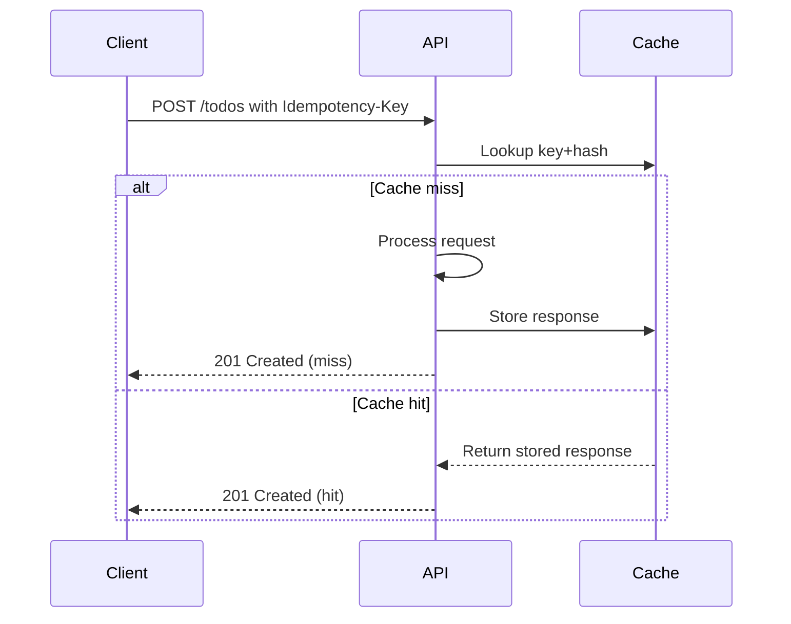

# Best-Practices API (ASP.NET Core 8)

Production-ready template showcasing **secure, observable, resilient REST APIs** on .NET 8.

---

## 🌐 Features

- API Versioning (URL segment)  
- Swagger (Dev only)  
- Security headers + CSP  
- ProblemDetails (validation 400s)  
- JSON-only requests (415 otherwise)  
- Idempotency for **all** HTTP methods via `Idempotency-Key`  
- Per-route & default rate limits  
- Kestrel hardening (size, timeouts, headers)  
- Polly (retry/timeout/circuit-breaker) for `HttpClient`  
- Health checks (live/ready)  
- OpenTelemetry → Azure Application Insights  
- HTTP logging (selected headers only)  
- Response compression & request decompression  
- CORS (allow-list)  
- CRUD Todos + ETag concurrency (If-Match/If-None-Match)  
- Environment-based config (`appsettings.*.json`)

---

## 🚀 Quick Start

From repo root:

```bash
dotnet restore
dotnet build AspNetBestPractice.sln
dotnet run --project src/Api
````

* Swagger UI (Dev only): `https://localhost:{port}/swagger`
* Health:

  * Liveness → `/health/live`
  * Readiness → `/health/ready`

---

## 🗂️ Architecture

```mermaid
flowchart LR
  Client[Client / Browser] -->|HTTPS| API[ASP.NET Core API]
  API -->|Validate & Route| Middleware[Middleware Pipeline]
  Middleware --> Controllers[Controllers]
  Controllers --> Repo[Repository (InMemory/DB)]
  Controllers --> Downstream[HttpClient + Polly]
  API -->|Metrics/Traces/Logs| Observability[(Azure Application Insights)]
```

---

## 🔀 Middleware Pipeline

```mermaid
flowchart TD
  A[Incoming Request] --> B[UseSecurityHeaders]
  B --> C[UseHttpsRedirection]
  C --> D[UseRateLimiter]
  D --> E[UseHttpLogging]
  E --> F[UseRequestDecompression]
  F --> G[JsonOnlyMiddleware]
  G --> H[IdempotencyMiddleware]
  H --> I[ExceptionHandlingMiddleware]
  I --> J[Routing → Controllers]
  J --> K[ResponseCompression]
  K --> L[Swagger (Dev only)]
  L --> M[Health Checks / Endpoints]
  M --> N[Outgoing Response]
```

---

## 🔑 Authentication / Authorization

* Supports pluggable schemes (`ApiKey`, `Jwt`, `AzureAd`, or `NoAuth` for Local).
* `ASPNETCORE_ENVIRONMENT=Local` or `Features:EnableAuth=false` disables auth for local testing.
* Active provider from config: `Authentication:Provider`.

Example `ApiKey` request:

```bash
curl -X POST "https://localhost:{port}/api/v1/todos" \
  -H "Content-Type: application/json" \
  -H "X-API-Key: YOUR_API_KEY" \
  -d '{"title":"task","notes":"notes"}'
```

---

## 🌀 Idempotency

Implemented via `IdempotencyMiddleware`.

* Applies to `GET, HEAD, POST, PUT, PATCH, DELETE` when `Idempotency-Key` header present.
* Key must be GUID (≤128 chars).
* Body methods → hash JSON body (SHA-256).
* Cache successful 2xx responses ≤256KB for 12h.
* Response header: `Idempotency-Cache: hit|miss`.



**Test (PowerShell):**

```powershell
$body = @{ title = 'idem test'; notes = 'first' } | ConvertTo-Json
$key  = [guid]::NewGuid().ToString()
Invoke-RestMethod -Method Post `
  -Uri "https://localhost:5232/api/v1/todos?api-version=1.0" `
  -ContentType 'application/json' `
  -Body $body `
  -Headers @{ 'Idempotency-Key' = $key }
```

---

## 🏷️ Cache & ETags

* `ETag` header returned on GET.
* Use `If-Match` for updates/deletes → optimistic concurrency.
* Use `If-None-Match` for conditional GET (304).

```http
GET /api/v1/todos/{id}
ETag: W/"638625748123456789"

PUT /api/v1/todos/{id}
If-Match: W/"638625748123456789"
```

---

## 🔒 Security Headers & CSP

Added by `UseSecurityHeaders()`:

* `Content-Security-Policy` (configurable)
* `X-Content-Type-Options: nosniff`
* `X-Frame-Options: DENY`
* `Referrer-Policy: no-referrer`
* `Cross-Origin-Resource-Policy: same-site`
* No-store cache headers

**Dev mode:** CSP relaxed to allow Swagger inline scripts/styles.

---

## 📈 Observability

* **Traces**: ASP.NET Core & HttpClient
* **Metrics**: ASP.NET Core, HttpClient, runtime
* **Logs**: structured, sent to Azure Monitor (if configured)

Config via `Observability:*` in `appsettings.*.json`.

---

## ⚡ Rate Limiting

* **Default policy** → 100 req/min
* **ExpensivePolicy** → 10 req/min (for write ops)
* **HealthPolicy** → 30 req/min

Returns **429 Too Many Requests** with `Retry-After`.

---

## 📦 Compression & Decompression

* **Response**: Brotli/Gzip for JSON
* **Request**: Transparent decompression for `gzip|br|deflate`

```bash
echo '{"title":"compressed"}' | gzip | \
curl -i -X POST "https://localhost:{port}/api/v1/todos" \
  -H "Content-Type: application/json" \
  -H "Content-Encoding: gzip" \
  --data-binary @-
```

---

## 📋 Example requests

**List todos**

```bash
curl -s "https://localhost:{port}/api/v1/todos?api-version=1.0"
```

**Create todo**

```bash
curl -i -X POST "https://localhost:{port}/api/v1/todos?api-version=1.0" \
  -H "Content-Type: application/json" \
  --data '{ "title":"Write docs", "notes":"Markdown cleanup" }'
```

**Update with `If-Match`**

```bash
curl -i -X PUT "https://localhost:{port}/api/v1/todos/{id}" \
  -H "Content-Type: application/json" \
  -H "If-Match: W/\"638625748123456789\"" \
  --data '{ "title":"Updated", "notes":"done", "isComplete": true }'
```

**Delete**

```bash
curl -i -X DELETE "https://localhost:{port}/api/v1/todos/{id}"
```

---

## 🩺 Health

* `/health/live` → process alive
* `/health/ready` → readiness JSON

---

## 🔧 Notes for production

* Swap `IMemoryCache` → Redis (`IDistributedCache`) for idempotency in multi-instance.
* Keep Swagger disabled outside Dev.
* Store secrets in **Key Vault** or environment variables.
* Tune OpenTelemetry sampling/logging to avoid PII and control cost.

---
