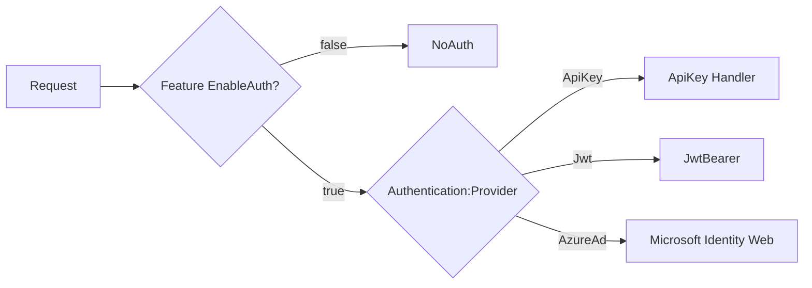

# Authentication: Azure AD, API Key, JWT and NoAuth (Local)

This document explains how to exercise each authentication mode and how the project supports local testing.

Modes supported

- Azure AD (via Microsoft.Identity.Web)
- JWT (standalone JwtBearer)
- API Key (custom header `X-API-Key`)
- NoAuth / LocalDev (development convenience)

How the app picks a scheme

- A policy scheme named `Dynamic` inspects a feature flag `Features:EnableAuth` and configuration `Authentication:Provider` to select the active scheme.
- If the feature flag `EnableAuth` is disabled, the policy forwards to `NoAuth`.

Local testing

- `Properties/launchSettings.json` sets `ASPNETCORE_ENVIRONMENT=Local` and `Features__EnableAuth=false` in the `http` profile for convenience.
- The `NoAuth` scheme returns a lightweight authenticated principal so controllers using `[Authorize]` behave as if a user is present.

Verify each mode

## NoAuth (Local)

- Start the app with the `http` launch profile. You should see a startup message saying auth is disabled for local/testing.
- Use the Swagger UI or curl/postman to hit protected endpoints. They should succeed without providing a real token.

## API Key

- Add `Authentication:ApiKey` to your configuration (appsettings or environment).
- Set `Authentication:Provider` to `ApiKey`.

Sample request:

```bash
curl -X POST "http://localhost:5232/api/v1/todos" -H "Content-Type: application/json" -H "X-API-Key: YOUR_KEY" -d '{"title":"t","notes":"n"}'
```

## JWT

- Configure `Authentication:JwtAuthority` and `Authentication:JwtAudience` in configuration.
- Provide a Bearer token in `Authorization: Bearer <token>` header.

## Azure AD

- Configure `AzureAd` section (tenant, client id, etc.) and use Microsoft Identity tokens.

Mermaid flow for Dynamic selection



To convert the above diagram to PNG at high resolution use the mermaid-cli command shown in other docs.

Screenshots

- `screenshots/HttpPost1.png` shows a successful POST; use it in README to show request/response.

Diagram


